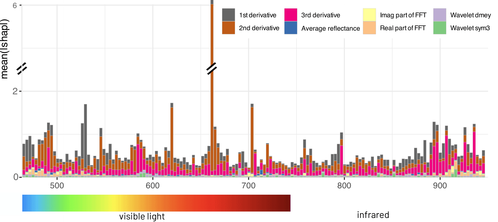
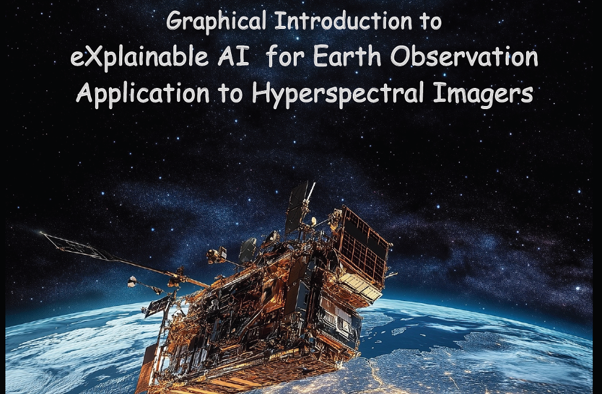

# Project

In **PINEAPPLE**, we aim to address the lack of "trust" in (deep) machine learning algorithms for earth observation. We tackle two real-life earth observation downstream tasks: **(1)** estimating soil parameters from hyperspectral imaging (HSI), and **(2)** detecting methane in HSI, using new deep and classic machine learning algorithms empowered by explainable AI (XAI) methods. 

We believe that **PINEAPPLE** will be an important step toward not only "uncovering the magic" behind learning algorithms (hence building trust in them in earth observation downstream tasks), but also in showing that XAI methods can be effectively used to improve such data-driven algorithms, ultimately leading to better predictive models.

We put special effort into:
1. unbiasing the validation of existing and emerging algorithms through ensuring their full reproducibility, both at the algorithm and at the data level, and
2. understanding & improving the generalization of such algorithms when fundamentally different data is used for testing, e.g. noisy, with simulated other atmospheric conditions, captured in different area/time.

Research project done in collaboration between **KP Labs** and **MI2.AI (Warsaw University of Technology)**; funded by the **European Space Agency** grant no. ESA AO/1-11524/22/I-DT.

    
    
    
    

# Team

|||||
| <b>Jakub Nalepa</b>   Head of HSI | <b>Paweł Skorupa</b>   Project Manager | <b>Łukasz Tulczyjew</b>   Research Scientist | <b>Agata Wijata</b>   Research Scientist |

|||||
| <b>Przemysław Biecek</b>   Head of XAI | <b>Hubert Baniecki</b>   Research Scientist | <b>Tymoteusz Kwieciński</b>   Software Engineer | <b>Vladimir Zaigrajew</b>   Research Scientist |

# Results

## Paper <small><a href="https://arxiv.org/abs/2403.08017">https://arxiv.org/abs/2403.08017</a></small>

**Red Teaming Models for Hyperspectral Image Analysis Using Explainable AI** 

*ICLR 2024 Workshop on Machine Learning for Remote Sensing (ML4RS)*

> Remote sensing applications require machine learning models that are reliable and robust, highlighting the importance of red teaming for uncovering flaws and biases. We introduce a novel red teaming approach for hyperspectral image analysis, specifically for soil parameter estimation in the Hyperview challenge. Utilizing SHAP for red teaming, we enhanced the top-performing model based on our findings. Additionally, we introduced a new visualization technique to improve model understanding in the hyperspectral domain.

## Graphical Overview 

<a href="https://www.dropbox.com/scl/fi/1n82yos6nsbpqgrr2n5gr/Pineapple-graphical-overview-v3-20250103.pdf?rlkey=blwwziqsfbhfthlpnl0gvxage&st=7cu51gr0&dl=0">Decoding Earth’s Layers. Graphical Introduction to eXplainable AI for Earth Observation Application to Hyperspectral Imagers.</a>

## Software <small><a href="https://github.com/xai4space/meteors">https://github.com/xai4space/meteors</a></small>

Python package for explanations of remote sensing imaginery.

### Meteors Package Presentation at Data Science Summit 2024

On November 22, 2024, in Warsaw, Vladimir Zaigrajew and Tymoteusz Kwieciński gave an in-person presentation of the Meteors package at the Data Science Summit 2024. The presentation was featured in the "Earth Observation and Geospatial Data" session. The package received a strong interest and positive feedback from the audience.

📊 [View presentation slides](https://github.com/xai4space/xai4space.github.io/tree/main/assets/materials/Meteors_DSS.pdf)

### Workshop on XAI for Remote Sensing at ESA Centre for Earth Observation in Frascati

> In September 2024, the MI2 and KP Labs teams led a joint workshop on XAI for Remote Sensing at the ESA's Phi-Lab in Frascati. The event focused on eXplainable Artificial Intelligence (XAI) applications in earth observation, with a special emphasis on hyperspectral imaging. During the workshop, XAI methods used in research and real-world applications were discussed along with the examples from the Meteors, which greatly facilitates the explanation process.

Some of the use-cases, can be already found in <a href="https://xai4space.github.io/meteors/latest/tutorials/introduction/">the tutorials</a> for the package

# Contact

**Email us at pineapple (at) kplabs.pl for any queries.**